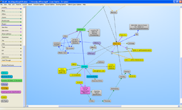

# About
MRI Ruby program for reading and analyzing the contents of a Yahoo News Group

# Usage
1. Update the configuration file 'yahoo.yml' to use your Yahoo login id, password, desired group name, etc
2. Update the range of messages to be downloaded in bin/archive.rb
3. Exec bin/archive.rb (e.g. Unix ./bin/archive.rb)

# Semantic Web (Web 3.0)
## What Is Web 3.0
* Cade Metz, "Web 3.0", PC Magazine, March 14, 2007 - http://www.pcmag.com/article2/0,2817,2102852,00.asp

"To many, Web 3.0 is something called the Semantic Web, a term coined by Tim Berners-Lee,
the man who invented the (first) World Wide Web.  In essence, the Semantic Web is a place
where machines can read Web pages much as we humans read them, a place where search engines
and software agents can better troll the Net and find what we're looking for.

"It's a set of standards that turns the Web into one big database," says Nova Spivack,
CEO of Radar Networks, one of the leading voices of this new-age Internet.

## Web 3.0 Books

* Watson, Mark, "Practical Semantic Web and Linked Data Applications: Java, JRuby, Scala,
and Clojure Edition", March 12, 2011 - http://www.markwatson.com/opencontent/book_java.pdf

* Toby Segaran, Colin Evans, Jamie Taylor, "Programming the Semantic Web: Build Flexible Applications
with Graph Data", O'Reilly Media, July 2009 - http://shop.oreilly.com/product/9780596153823.do

## Web 3.0 Tools
### Open Calais
The OpenCalais Web Service automatically creates rich semantic metadata for the content you
submit – in well under a second. Using natural language processing (NLP), machine
learning and other methods, Calais analyzes your document and finds the entities within it.
But, Calais goes well beyond classic entity identification and returns the facts and events
hidden within your text as well.

* http://www.opencalais.com/documentation/calais-web-service-api

### Open Amplify
The OpenAmplify Web Service is the first and only of its kind. It exposes, via an open API, 250
man-years of development effort in a web service based upon more than a dozen granted patents.
OpenAmplify simply does a better job of surfacing the meaning of web content, at massive scale
and speed. Here's an overview of the thinking and technology that makes it possible.

* http://www.openamplify.com/technology

### Zemanta
Note, the Zemanta link for the programmable interface is here:

* http://developer.zemanta.com/member/register/

Zemanta's core technology is widely acclaimed as one of the best semantic recommendations
engines on the market.  The basis for Zemanta's suggestions are state of the art algorithms
for processing natural language, machine learning, information retrieval and similar.

* http://www.zemanta.com/outreach/technology/

### AlchemyAPI
Identify people, companies, organizations, cities, geographic features, and other typed 
entities within HTML pages, text documents/content, and scanned document images. 
Our advanced named entity recognition (NER) capability supports multiple languages and 
offers comprehensive disambiguation capabilities not found in other solutions.

* http://www.alchemyapi.com/api/entity/types.html

### AllegroGraph
AllegroGraph is a modern, high-performance, persistent graph database. AllegroGraph uses
efficient memory utilization in combination with disk-based storage, enabling it to scale
to billions of quads while maintaining superior performance.

AllegroGraph supports SPARQL, RDFS++, and Prolog reasoning from numerous client applications.

* http://www.franz.com/agraph/allegrograph/

### Gruff
Gruff is a Grapher-Based Triple-Store Browser for AllegroGraph

The free-form nature of triple-store data offers a lot of flexibility for constructing
databases, but that freedom can also make it less obvious how to find arbitrary data for
retrieval, error-checking, or general browsing.

Gruff is a freely downloadable graphical triple-store browser that attempts to make
data retrieval more pleasant and powerful with a variety of tools for laying out cyclical
graphs, displaying tables of properties, managing queries, and building queries as
visual diagrams.

* http://www.franz.com/agraph/gruff/

## Web 3.0 Online Examples
To illustrate these tools, paste the text of one of the downloaded messages into 
 
* http://viewer.opencalais.com/
* http://openamplify.com/
* http://www.zemanta.com/demo/
* http://www.alchemyapi.com/api/demo.html

## License
Yahoo is released under the Ruby license (see the LICENSE file), which is compatible with the
GNU GPL (see the COPYING file) via an explicit dual-licensing clause.
